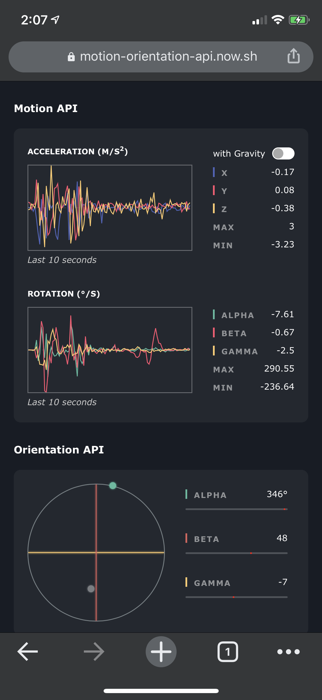

# Motion & Orientation API

<p align="center">
	<a href="https://motion-orientation-api.now.sh">
		
	</a>
</p>

A site to visualize and better understand the Web [Motion & Orientation API](https://developers.google.com/web/fundamentals/native-hardware/device-orientation). [Visit on your mobile device](https://motion-orientation-api.now.sh).

## Development

```bash
# install dependencies
$ npm ci

# serve with hot reload at localhost:3000
$ npm run dev
```
